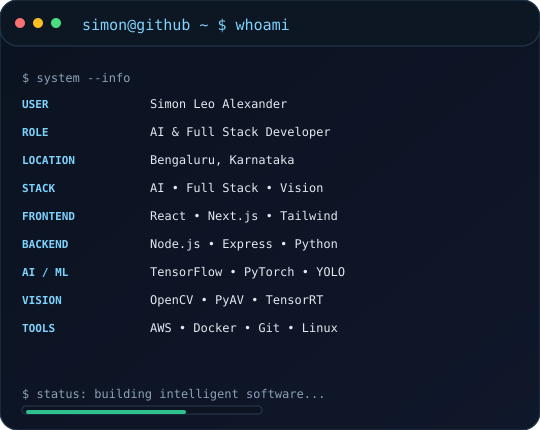
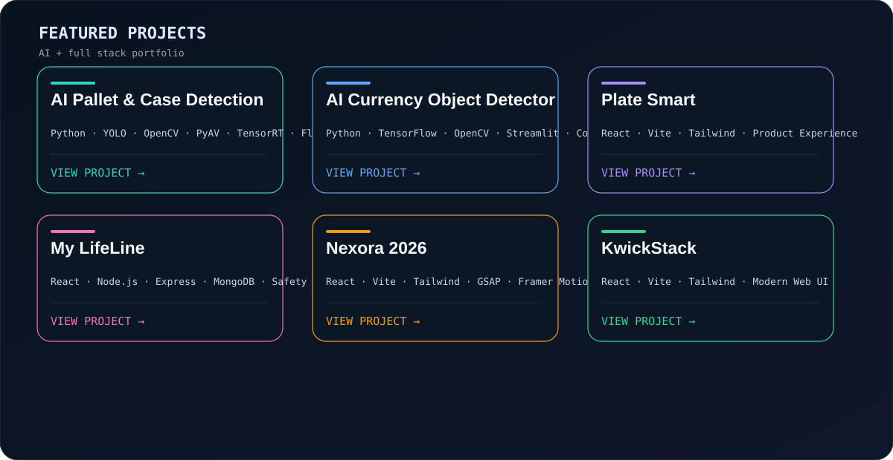
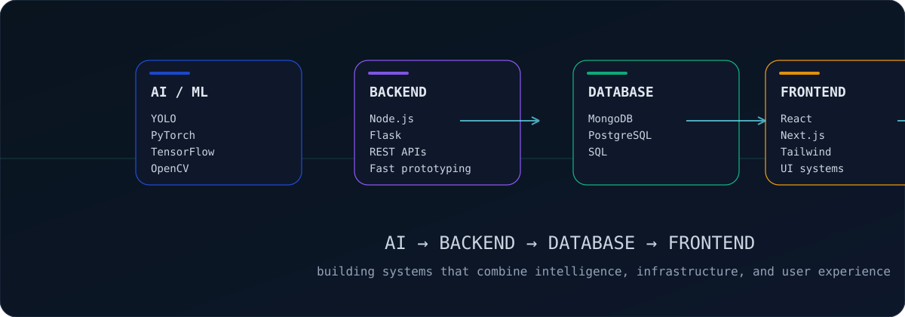

  

---

  <h3><code>$ whoami</code></h3>

<table>
  <tr>
    <td width="46%" valign="top">
      
    </td>
    <td width="54%" valign="top">
      

        
Simon Leo Alexander

        
AI &amp; Full Stack Developer

        

          Focused on building practical systems that combine <strong style="color: #7dd3fc;">AI-powered products</strong>, scalable web platforms, and real-time vision workflows.
        

        

          I am a final-year Information Science &amp; Engineering student building intelligent applications across <strong style="color: #a78bfa;">full stack development</strong>, <strong style="color: #34d399;">computer vision</strong>, and <strong style="color: #fbbf24;">automation</strong>.
        

      

    </td>
  </tr>
</table>

---

  <h3><code>$ tech --stack</code></h3>

<table>
  <tr>
    <td width="33%" valign="top">
      

        
01 / FRONTEND

        
React

        
Next.js

        
JavaScript

        
Tailwind CSS

      

    </td>
    <td width="33%" valign="top">
      

        
02 / BACKEND

        
Node.js

        
Express

        
REST APIs

        
Python

      

    </td>
    <td width="33%" valign="top">
      

        
03 / AI / ML

        
Python

        
TensorFlow

        
PyTorch

        
YOLO · OpenCV

      

    </td>
  </tr>
  <tr>
    <td width="33%" valign="top">
      

        
04 / DATABASE

        
MongoDB

        
PostgreSQL

        
SQL

      

    </td>
    <td width="33%" valign="top">
      

        
05 / DEVOPS

        
Git

        
GitHub

        
AWS

        
Linux · Docker

      

    </td>
    <td width="33%" valign="top">
      

        
06 / VISION

        
YOLO

        
OpenCV

        
PyAV

        
TensorRT

      

    </td>
  </tr>
</table>

---

  <h3><code>$ what_i_build</code></h3>

<table>
  <tr>
    <td width="33%" valign="top">
      

        
CARD 01

        <h3 style="margin: 0 0 10px; font-size: 24px; color: #f8fafc;">AI / MACHINE LEARNING</h3>
        

          Build intelligent applications using Python, TensorFlow, PyTorch, YOLO, and agentic AI workflows.
        

      

    </td>
    <td width="33%" valign="top">
      

        
CARD 02

        <h3 style="margin: 0 0 10px; font-size: 24px; color: #f8fafc;">FULL STACK SYSTEMS</h3>
        

          Build complete web applications with React, Next.js, Node.js, Express, and MongoDB for production-ready experiences.
        

      

    </td>
    <td width="33%" valign="top">
      

        
CARD 03

        <h3 style="margin: 0 0 10px; font-size: 24px; color: #f8fafc;">COMPUTER VISION</h3>
        

          Build real-time vision systems using YOLO, OpenCV, PyAV, TensorRT, Flask, and Electron-based tooling.
        

      

    </td>
  </tr>
</table>

---

  

### Featured project links

- [AI Pallet &amp; Case Detection](https://github.com/SimonLeo28/God-s-Eye)
- [AI Currency Object Detector](https://github.com/SimonLeo28/ai-currency-object-detector)
- [Plate Smart](https://github.com/SimonLeo28/Plate_Smart)
- [My LifeLine](https://github.com/SimonLeo28/MyLifeLine)
- [Nexora 2026](https://github.com/SimonLeo28/Nexora-2026)
- [KwickStack](https://github.com/SimonLeo28/kwickstack)

---

  <h3><code>$ architecture</code></h3>

  

---

  <h3><code>$ current_focus</code></h3>

<table>
  <tr>
    <td width="50%" valign="top">
      

        
CURRENTLY BUILDING

        
&gt; AI-powered applications &gt; Full-stack web platforms &gt; Computer vision systems &gt; Real-time data systems &gt; Automation workflows

      

    </td>
    <td width="50%" valign="top">
      

        
CURRENTLY LEARNING

        
&gt; Advanced AI/ML &gt; Agentic AI &gt; Cloud deployment &gt; Scalable backend architecture

      

    </td>
  </tr>
</table>

---

  <h3><code>$ system_activity</code></h3>

  

---

  <h3><code>$ connect</code></h3>

  <a href="https://github.com/SimonLeo28" style="color: #7dd3fc; text-decoration: none;">GitHub</a>
  &nbsp;•&nbsp;
  <a href="https://github.com/SimonLeo28/SimonLeo28" style="color: #7dd3fc; text-decoration: none;">Portfolio</a>
  &nbsp;•&nbsp;
  LinkedIn: not shared publicly
  &nbsp;•&nbsp;
  Email: not shared publicly

LET'S BUILD SOMETHING

AI • Full Stack Development • Computer Vision • Software Engineering

---

Bengaluru, Karnataka, India
