

<a href="https://github.com/SimonLeo28">
  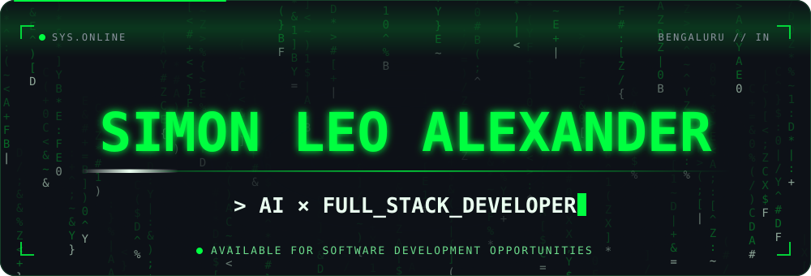
</a>

&nbsp;
&nbsp;
&nbsp;

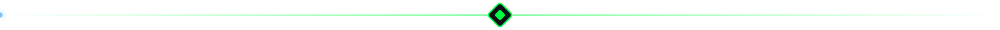

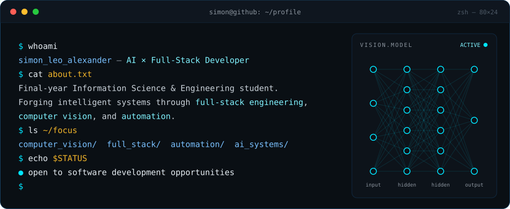

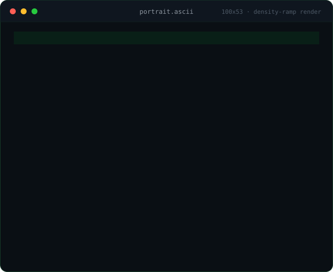

## Tech Stack

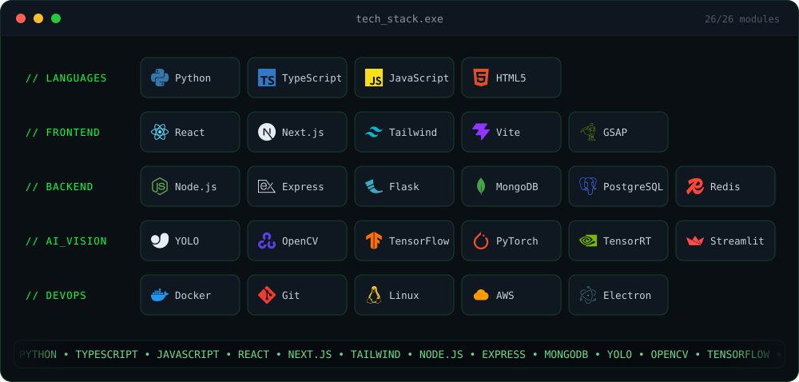

## Featured Projects

<table>
<tr>
<td width="50%">
<a href="https://github.com/SimonLeo28/God-s-Eye">
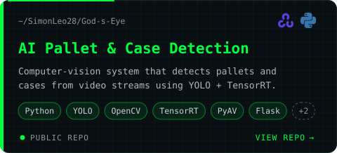
</a>
</td>
<td width="50%">
<a href="https://github.com/SimonLeo28/ai-currency-object-detector">
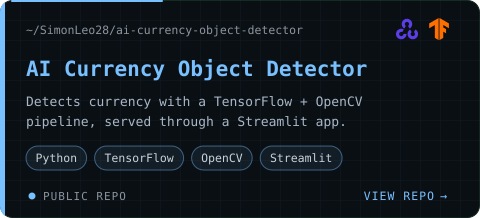
</a>
</td>
</tr>
<tr>
<td width="50%">
<a href="https://github.com/SimonLeo28/Plate_Smart">
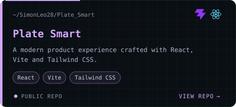
</a>
</td>
<td width="50%">
<a href="https://github.com/SimonLeo28/MyLifeLine">
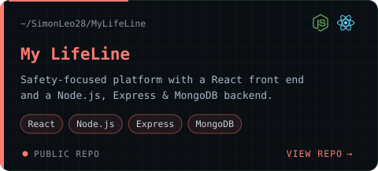
</a>
</td>
</tr>
<tr>
<td width="50%">
<a href="https://github.com/SimonLeo28/Nexora-2026">
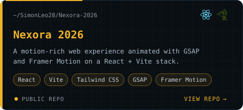
</a>
</td>
<td width="50%">
<a href="https://github.com/SimonLeo28/kwickstack">
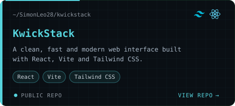
</a>
</td>
</tr>
</table>

<a href="https://github.com/SimonLeo28?tab=repositories">→ 24 more repositories on GitHub</a>

## GitHub Activity

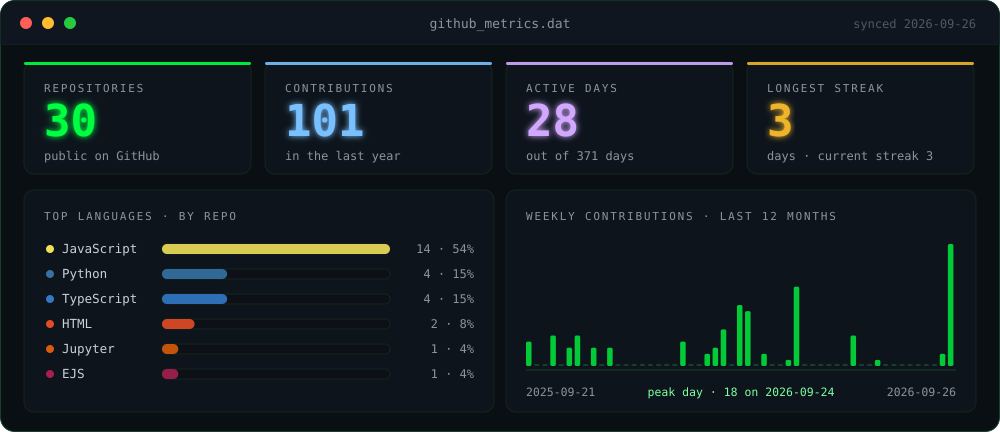

 

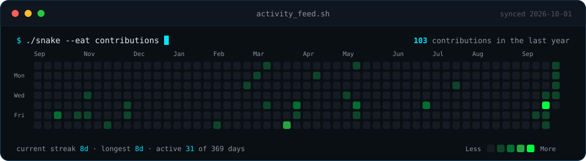

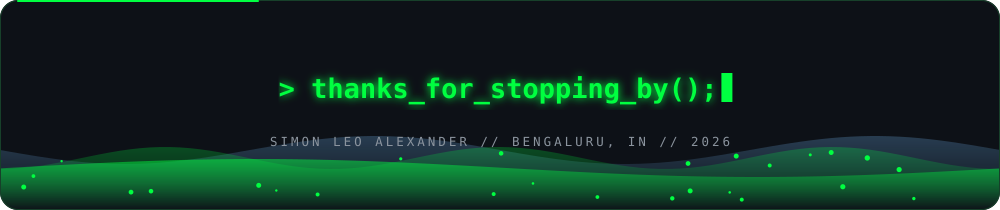

<!--
  Every image above is a self-contained, hand-written SVG in /assets — no
  third-party stats or badge services are used, so nothing here can break
  because someone else's server is rate-limited or offline. Data comes from
  data/contributions.json and data/stats.json, refreshed daily by
  .github/workflows/update-profile.yml and regenerated with
  scripts/build_all.py.
-->
